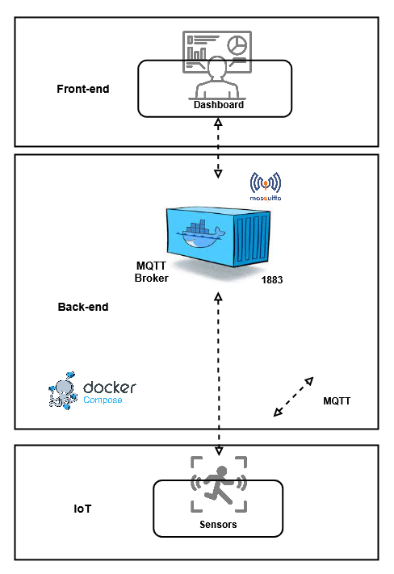
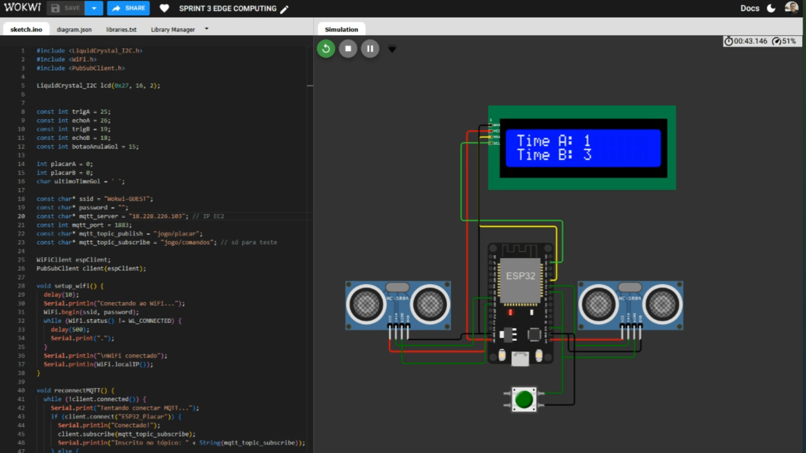
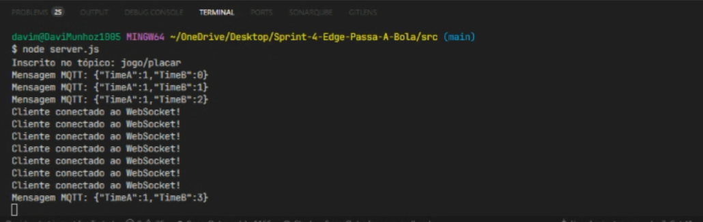
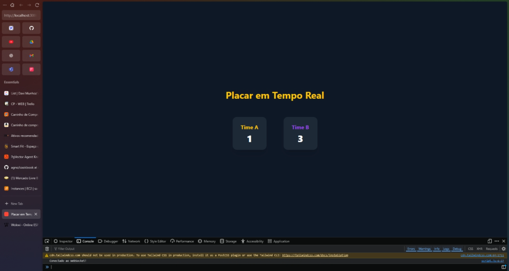

# ⚽ IoT Smart Scoreboard

Este projeto implementa um sistema de placar em tempo real usando **IoT** + **MQTT** + **Node.js** + **WebSockets**..

A arquitetura está dividida em:

- **IoT (sensores)** → enviam dados via MQTT
- **Mosquitto (broker MQTT em Docker)** → recebe e distribui mensagens
- **Back-end (Node.js + WebSocket)** → consome MQTT e repassa para os clientes conectados
- **Front-end (HTML + Tailwind)** → exibe o placar atualizado em tempo real

## 📝 Descrição do Projeto

Este projeto cria um placar inteligente para partidas amadoras de futebol de mesa, usando IoT para detecção de gols e integração com servidor e dashboard em tempo real.

- O ESP32 lê sensores de barreira IR e botão de anulação de gols.
- O LCD I2C exibe o placar localmente.
- Cada gol é enviado a um servidor Node.js, que retransmite os dados via WebSocket para clientes conectados (front-end HTML/Tailwind).
- A arquitetura também suporta MQTT via Mosquitto, permitindo comunicação confiável entre sensores e back-end.

O objetivo é proporcionar experiência semelhante à de jogos profissionais, com placar automatizado e atualizado em tempo real, aumentando o engajamento do público.

## 🎯 Escopo

- Protótipo com ESP32, sensor IR, LCD I2C e botão;
- Simulação no Wokwi, com possibilidade de migração para hardware real;
- Integração com servidor Node.js via MQTT e WebSocket;
- Exibição de placar em tempo real em front-end web.

## 🏗️ Arquitetura do Sistema

A arquitetura integra sensores físicos, processamento em tempo real e visualização em painel de controle:

- 🛰️ **Sensores IoT (IR)**: Detectam quando a bola cruza a linha do gol;
- 📡 **MQTT Broker (Mosquitto via Docker)**: Recebe e distribui mensagens publicadas pelo ESP32;
- 🔄 **Back-end WebSocket**: Consome mensagens MQTT e repassa para o front-end em tempo real;
- 🖥️ **LCD I2C**: Mostra o placar físico;
- 🌐 **Front-end Web**: Atualiza interface em tempo real via WebSocket.

<div align="center">

<p align="center">
  
</p>

</div>

## 🏅 Resultados da PoC (Prova de Conceito)

Durante a PoC, o sistema foi na **simulação Wokwi (ESP32 + sensores IR + LCD)**.

### Principais Resultados

- ✅ **Detecção de gols**: A barreira IR detectou corretamente a passagem da bola, incrementando o placar no LCD;
- ✅ **Anulação de gols**: O botão permitiu remover o último gol registrado de forma imediata;
- ✅ **Integração com back-end**: Mensagens MQTT foram recebidas pelo servidor Node.js e retransmitidas via WebSocket para o front-end;
- ✅ **Atualização em tempo real**: O front-end refletiu os gols em menos de 1 segundo após o evento;
- ✅ **Simulação fiel**: A simulação no Wokwi reproduziu corretamente o comportamento do hardware físico, validando o firmware sem necessidade de componentes reais;

### Observações

- Ajustes finos de debounce e tempo de leitura foram necessários para evitar falsos positivos no sensor IR;
- As permissões de leitura/escrita nos volumes Docker foram essenciais para o Mosquitto iniciar corretamente;
- O sistema provou ser robusto, escalável e de fácil integração, servindo como base para desenvolvimento completo do placar inteligente.

## 📸 Prints Demonstrativos da Integração IoT

### ESP32 do Placar



### Servidor Express Integrado à VM



### Tela Frontend Integrada ao WebSocket



## 🧰 Componentes Utilizados

- ESP32 Dev Module
- Sensor IR (barreira) ×2
- Botão
- LCD I2C
- Jumpers

### Função dos Componentes

- **Sensor IR**: Detecta passagem da bola (entrada digital);
- **ESP32**: Lê sensores, incrementa contador e envia dados via Wi-Fi;
- **Botão**: Anula último gol;
- **LCD I2C**: Exibe placar localmente.

## 🛠️ Recursos Necessários

### Hardware (Simulação no Wokwi)

- ESP32, sensores IR, botão, LCD I2C, cabos jumper.

### Hardware (Físico)

- Mesmo da simulação + cabo USB e fonte de alimentação.

### Software / Ferramentas

- Arduino IDE ou PlatformIO (ESP32);
- Wokwi (simulação);
- Node.js + Express + WebSocket;
- Mosquitto (Docker);
- Navegador moderno para front-end.

### Bibliotecas Recomendadas

- WiFi.h, HTTPClient.h, PubSubClient (MQTT), LiquidCrystal_I2C.h

## 💻 Simulação Wokwi

Para testar o projeto sem precisar da VM ou hardware físico, você pode usar a simulação no **Wokwi**:  
[Link da Simulação Wokwi](https://wokwi.com/projects/441846636237669377)

⚠️ **Atenção:** no código da simulação, é necessário alterar o IP do broker MQTT para o IP público da sua VM (onde o Mosquitto está rodando).  

No arquivo da simulação, procure:  

```cpp

const char* ssid = "Wokwi-GUEST";
const char* password = "";
const char* mqtt_server = "<SEU_IP_DA_VM>"; // Troque pelo IP da sua VM
const int mqtt_port = 1883;
const char* mqtt_topic_publish = "jogo/placar";
const char* mqtt_topic_subscribe = "jogo/comandos"; // só para teste

```

Todo o funcionamento do sistema de monitoramento com IRs, botão e display LCD I2C está implementado no código ESP32 a seguir:

[👉 Visualizar código no GitHub](codigo_fonte_esp.cpp)


## 📂 Estrutura de Pastas

```bash

.
├── src/
│   ├── server.js           
│   ├── package.json
│   └── package-lock.json
│
├── public/
│   ├── script.js
│   ├── index.html 
│   └── src/            
│       └── imgs/
│           └── system_arquiteture.png
├── mosquitto/
│   └── config/
│       └── mosquitto.conf  
│
├── docker-compose.yaml
│
├── .gitignore
└── README.md

```

## 🚀 Como Rodar

### 1. Pré-requisitos

- [Node.js](https://nodejs.org/) 18+
- [Docker](https://docs.docker.com/get-docker/) e [Docker Compose](https://docs.docker.com/compose/)

### 2. Subir o broker Mosquitto (MQTT)

No diretório raiz do projeto, execute o seguinte comando:

```bash

docker compose up -d

```

Isso vai iniciar o **Mosquitto** na porta **1883 (MQTT)** e armazenar dados em `mosquitto/data` e logs em `mosquitto/log`.

### 3. Rodar o back-end (Node.js)

No diretório raiz do projeto, execute os seguintes comandos:

```bash

cd src
npm install

```

⚠️ **Importante**: No arquivo `backend/server.js`, altere a constante `MQTT_HOST` para o IP público da sua VM onde está rodando o Mosquitto.  

```js

const MQTT_HOST = "mqtt://SEU_IP_DA_VM:1883";

```

Após alterar o IP, rode o seguinte comando:

```bash

node server.js

```

O servidor vai rodar em `http://localhost:3000`.

Ele:

- Conecta no **Mosquitto**
- Se inscreve no tópico `jogo/placar`
- Expõe um **WebSocket** para os clientes do front-end

### 4. Acessar o front-end

O front já está servido pelo próprio `server.js`.
Basta abrir no navegador `http://localhost:3000`.

Você verá o placar em tempo real, que será atualizado conforme mensagens MQTT chegam.

## 📡 Fluxo de Comunicação

- Sensor envia mensagem MQTT → `mosquitto` (porta 1883)
- Back-end (Node.js) consome a mensagem do tópico `jogo/placar`
- Back-end retransmite via WebSocket
- Front-end recebe e atualiza a interface em tempo real

## 🛠 Tecnologias

- Mosquitto (Broker MQTT)
- Docker + Compose
- Node.js + Express + WebSocket + MQTT.js
- TailwindCSS (Front-end bonito e responsivo)

## 👥 Integrantes do Grupo

| [<br><sub>Davi Marques</sub>](https://github.com/DaviMunhoz1005) |  [<br><sub>Gabriel Ciriaco</sub>](https://github.com/Gabsgc01) | [<br><sub>Mariana Souza</sub>](https://github.com/MariFranca) | [<br><sub>Larissa Shiba</sub>](https://github.com/larissashiba) | [<br><sub>Vinicius Mafra</sub>](https://github.com/Mafraaa) | 
| :---: | :---: | :---: | :---: | :---: |
